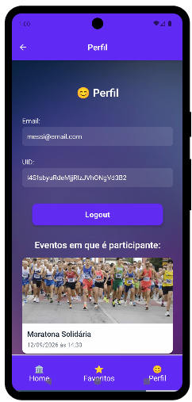

# EventBuddy 📱

EventBuddy is a React Native mobile application that helps users discover, create, and manage events. With features like event favoriting, participation tracking, and admin controls, it's the perfect companion for event organization and attendance.

## 🌟 Features

- **User Authentication**: Secure login and signup system
- **Event Discovery**: Browse through available events with search functionality
- **Event Management (admin only)**: Create, edit, and delete events
- **Event Participation**: Join events and track attendance
- **Favorites System**: Save your favorite events for quick access
- **User Profiles**: View your participation history and manage preferences
- **Real-time Updates**: Get instant updates on event changes
- **Modern UI**: Clean and intuitive interface with smooth animations

## 📱 Screenshots

### Authentication


### Events List


### Event Details


### Favorites


### Profile


## 📋 Required Dependencies

```json
{
  "expo": "~53.0.20",
  "expo-status-bar": "~2.2.3",
  "react": "19.0.0",
  "react-native": "0.79.5",
  "firebase": "*",
  "expo-image-picker": "~16.1.4",
  "react-native-uuid": "*",
  "@expo/vector-icons": "^14.1.0",
  "react-native-paper": "4.9.2",
  "react-native-screens": "~4.11.1",
  "@react-navigation/stack": "*",
  "@react-navigation/native": "*",
  "react-native-vector-icons": "*",
  "react-native-gesture-handler": "~2.24.0",
  "@react-navigation/bottom-tabs": "^6.0.0",
  "react-native-safe-area-context": "5.4.0"
}
```

## 🛠 Firebase Setup

Before running the app, you'll need to set up Firebase:

1. Create a new Firebase project at [Firebase Console](https://console.firebase.google.com)
2. Enable Authentication with Email/Password
3. Enable Cloud Firestore
4. Copy your Firebase configuration and replace it in `firebaseConfig.js`:

```javascript
const firebaseConfig = {
  apiKey: "your-api-key",
  authDomain: "your-auth-domain",
  projectId: "your-project-id",
  storageBucket: "your-storage-bucket",
  messagingSenderId: "your-sender-id",
  appId: "your-app-id"
};
```

## 🚀 Running the App

### Local Development
1. Install dependencies:
   ```bash
   npm install
   # or
   yarn install
   ```

2. Start the development server:
   ```bash
   npm start
   # or
   yarn start
   ```

3. Run on device/emulator:
   - Install Expo Go on your mobile device
   - Scan the QR code from the terminal
   - Or run on emulator:
     ```bash
     npm run android
     # or
     npm run ios
     ```

## 📱 App Features

### For Users
- Browse upcoming events
- Search events by title
- Save favorite events
- Join/leave events
- View event details and participant count
- Track your event participation history

### For Admins
- Create new events
- Edit existing events
- Delete events
- View participant lists

## 🔒 Authentication

The app uses Firebase Authentication with email/password. Users can:
- Sign up with email and password
- Log in with existing credentials
- Log out securely

## 🎨 UI/UX Features

- Modern purple theme (#5e17eb)
- Consistent navigation bar across screens
- Real-time updates for events and favorites
- Smooth transitions and animations
- Responsive layout for different screen sizes
- Image upload for events

## 📚 Additional Resources

- [Expo Documentation](https://docs.expo.dev)
- [React Native Documentation](https://reactnative.dev/docs/getting-started)
- [Firebase Documentation](https://firebase.google.com/docs)
- [React Navigation Documentation](https://reactnavigation.org/docs/getting-started)

## 🤝 Contributing

Contributions are welcome! Please feel free to submit a Pull Request.

## 📄 License

This project is licensed under the MIT License.
